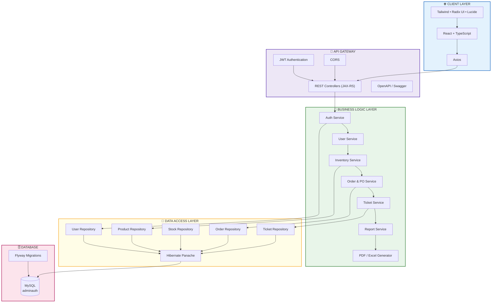

# Architecture Diagram & Tech Stack

## System Architecture Overview

### Visual Architecture Diagram (Mermaid)



### Text-Based Architecture Diagram

```
┌─────────────────────────────────────────────────────────────────────────┐
│                          CLIENT LAYER                                   │
│  ┌───────────────────────────────────────────────────────────────────┐  │
│  │                    React Frontend Application                      │  │
│  │  - React 19.2.0                                                    │  │
│  │  - TypeScript 5.9.3                                                │  │
│  │  - Vite (Build Tool)                                               │  │
│  │  - React Router DOM 7.11.0                                         │  │
│  │  - Axios 1.13.2 (HTTP Client)                                      │  │
│  │  - Tailwind CSS (Styling)                                          │  │
│  │  - Lucide React (Icons)                                            │  │
│  │  - Radix UI (Component Library)                                    │  │
│  └───────────────────────────────────────────────────────────────────┘  │
└─────────────────────────────────────────────────────────────────────────┘
                                    │
                                    │ HTTPS/REST API
                                    │ (Port 5173 → 9090)
                                    │
┌───────────────────────────────────▼─────────────────────────────────────┐
│                        APPLICATION LAYER                                │
│  ┌───────────────────────────────────────────────────────────────────┐  │
│  │                   Quarkus REST API                                 │  │
│  │  - Quarkus 3.30.5 (Java Framework)                                 │  │
│  │  - Java 21                                                          │  │
│  │  - REST Endpoints (JAX-RS)                                         │  │
│  │  - JWT Authentication (SmallRye JWT)                               │  │
│  │  - CORS Enabled                                                    │  │
│  └───────────────────────────────────────────────────────────────────┘  │
│                              │                                           │
│  ┌───────────────────────────▼───────────────────────────────────────┐  │
│  │                      BUSINESS LAYER                                │  │
│  │  ┌─────────────────────────────────────────────────────────────┐  │  │
│  │  │  Service Layer                                               │  │  │
│  │  │  - AuthService (Authentication & Authorization)              │  │  │
│  │  │  - UserService (User Management)                             │  │  │
│  │  │  - ProductService (Product Management)                       │  │  │
│  │  │  - StockService (Inventory Management)                       │  │  │
│  │  │  - DashboardService (Analytics)                              │  │  │
│  │  │  - ReportService (Report Generation)                         │  │  │
│  │  │  - OrderService (Order Management)                           │  │  │
│  │  │  - TicketService (Support Tickets)                           │  │  │
│  │  │  - ReportFileGenerator (PDF/Excel/CSV)                       │  │  │
│  │  └─────────────────────────────────────────────────────────────┘  │  │
│  └───────────────────────────────────────────────────────────────────┘  │
│                              │                                           │
│  ┌───────────────────────────▼───────────────────────────────────────┐  │
│  │                      PERSISTENCE LAYER                             │  │
│  │  ┌─────────────────────────────────────────────────────────────┐  │  │
│  │  │  Repository Layer (Hibernate Panache)                        │  │  │
│  │  │  - UserRepository                                            │  │  │
│  │  │  - ProductRepository                                         │  │  │
│  │  │  - StockRepository                                           │  │  │
│  │  │  - OrderRepository                                           │  │  │
│  │  │  - TicketRepository                                          │  │  │
│  │  └─────────────────────────────────────────────────────────────┘  │  │
│  └───────────────────────────────────────────────────────────────────┘  │
│                              │                                           │
└──────────────────────────────▼──────────────────────────────────────────┘
                        │
                        │ JDBC
                        │
┌───────────────────────▼─────────────────────────────────────────────────┐
│                         DATA LAYER                                      │
│  ┌───────────────────────────────────────────────────────────────────┐  │
│  │                    MySQL Database                                  │  │
│  │  - MySQL 5.6.19                                                    │  │
│  │  - Database: adminauth                                             │  │
│  │  - Flyway (Schema Migrations)                                      │  │
│  │  - Hibernate ORM (Object-Relational Mapping)                      │  │
│  └───────────────────────────────────────────────────────────────────┘  │
└─────────────────────────────────────────────────────────────────────────┘
```

## Tech Stack Details

### Frontend Technology Stack

#### Core Framework & Language
- **React** 19.2.0 - UI library for building user interfaces
- **TypeScript** 5.9.3 - Typed superset of JavaScript
- **Vite** (rolldown-vite 7.2.5) - Fast build tool and dev server

#### Routing & State Management
- **React Router DOM** 7.11.0 - Client-side routing
- React Hooks (useState, useEffect) - State management

#### HTTP Client
- **Axios** 1.13.2 - Promise-based HTTP client for API calls

#### UI/UX Libraries
- **Tailwind CSS** - Utility-first CSS framework (via tailwind-merge)
- **Lucide React** 0.562.0 - Icon library
- **Radix UI** - Unstyled, accessible component primitives
  - @radix-ui/react-checkbox
  - @radix-ui/react-label
  - @radix-ui/react-slot

#### Utility Libraries
- **clsx** 2.1.1 - Utility for constructing className strings
- **class-variance-authority** 0.7.1 - Component variant styling
- **tailwind-merge** 3.4.0 - Merge Tailwind CSS classes

#### Development Tools
- **ESLint** 9.39.1 - Code linting
- **TypeScript ESLint** 8.46.4 - TypeScript-specific linting rules
- **Babel Plugin React Compiler** - React compiler plugin

---

### Backend Technology Stack

#### Core Framework
- **Quarkus** 3.30.5 - Supersonic Subatomic Java Framework
- **Java** 21 - Programming language
- **Maven** - Build automation and dependency management

#### REST API
- **Quarkus REST** (JAX-RS) - RESTful web services
- **Jackson** (via quarkus-rest-jackson) - JSON serialization/deserialization
- **OpenAPI/Swagger** (quarkus-smallrye-openapi) - API documentation
- **CORS** - Cross-Origin Resource Sharing enabled

#### Security & Authentication
- **SmallRye JWT** - JSON Web Token implementation
  - quarkus-smallrye-jwt (Verification)
  - quarkus-smallrye-jwt-build (Token generation)
- **Quarkus Security** - Security framework
- **JWT Algorithm**: HS256 (HS256 secret key)
- **JWT Expiration**: 24 hours

#### Database & ORM
- **MySQL** 5.6.19 - Relational database management system
- **Hibernate ORM** - Object-Relational Mapping framework
- **Hibernate Panache** - Simplifies Hibernate ORM with active record/repository patterns
- **Flyway** - Database migration tool
- **JDBC Driver for MySQL** - Database connectivity

#### Validation & Data Processing
- **Hibernate Validator** - Bean validation (JSR 303/380)
- **Quarkus Arc** - Dependency injection framework (CDI)

#### File Generation & Processing
- **iTextPDF** 7.2.5 - PDF generation library
  - kernel
  - layout
- **Apache POI** 5.3.0 - Microsoft Office document processing (Excel, CSV)
  - poi-ooxml

#### Password Hashing
- **jBCrypt** 0.4 - Password hashing library

#### Testing
- **JUnit 5** (quarkus-junit5) - Unit testing framework
- **REST Assured** - API testing library

---

## System Architecture Layers

### 1. Presentation Layer (Frontend)
- **Location**: `frontend/admin_inventory/`
- **Purpose**: User interface and user interactions
- **Technologies**: React, TypeScript, Tailwind CSS
- **Port**: 5173 (Development)

### 2. API Layer (Backend)
- **Location**: `backend/adminauth/src/main/java/org/cencora/`
- **Purpose**: RESTful API endpoints
- **Technologies**: Quarkus REST, JAX-RS
- **Port**: 9090
- **Documentation**: Swagger UI at `/swagger-ui`

### 3. Business Logic Layer
- **Components**:
  - Controllers (REST endpoints)
  - Services (Business logic)
  - DTOs (Data Transfer Objects)
- **Packages**:
  - `adminapproval` - Authentication & User Management
  - `inventorymanagement` - Inventory, Products, Stock
  - `ordermanagement` - Orders, Prescriptions, Purchase Orders
  - `ticketmanagement` - Support Tickets

### 4. Data Access Layer
- **Components**:
  - Repositories (Hibernate Panache)
  - Entities (JPA/Hibernate)
- **Purpose**: Database interactions and data persistence

### 5. Database Layer
- **Database**: MySQL (adminauth)
- **Schema Management**: Flyway migrations
- **Tables**: Users, Products, Orders, Tickets, Stock, etc.

---

## Module Structure

### Frontend Modules (`frontend/admin_inventory/src/`)
```
src/
├── components/         # Reusable UI components
├── pages/             # Page components
│   ├── compliance/    # Prescription validation, Document checks
│   ├── inventory/     # Product management, Catalog
│   ├── monitoring/    # Stock levels, Alerts, Expiry tracking
│   ├── orders/        # Orders, Approvals, Support tickets
│   └── reports/       # Report generation, Data export
├── sevices/           # API service layers (Axios clients)
└── styles/            # Global styles
```

### Backend Modules (`backend/adminauth/src/main/java/org/cencora/`)
```
org/cencora/
├── adminapproval/     # Authentication & User Management
│   ├── controller/    # AuthController, UserController
│   ├── service/       # AuthService, UserService, JwtService
│   ├── entity/        # User entity
│   └── dto/           # Request/Response DTOs
├── inventorymanagement/  # Inventory Management
│   ├── controller/    # Product, Stock, Dashboard, Report controllers
│   ├── service/       # Business logic services
│   ├── repository/    # Data access repositories
│   ├── entity/        # Product, Stock, Warehouse entities
│   └── dto/           # Data transfer objects
├── ordermanagement/   # Order Processing
│   ├── controller/    # Order, Purchase Order controllers
│   ├── service/       # Order services
│   └── entity/        # Order, Prescription entities
└── ticketmanagement/  # Support Ticket System
    ├── controller/    # Ticket controller
    ├── service/       # Ticket service
    └── entity/        # Ticket entities
```

---

## Authentication Flow

```
1. User Login Request
   ↓
2. Frontend → POST /api/auth/login
   ↓
3. Backend validates credentials
   ↓
4. JWT Token generated (SmallRye JWT)
   ↓
5. Token returned to frontend
   ↓
6. Frontend stores token (localStorage)
   ↓
7. Subsequent requests include: Authorization: Bearer <token>
   ↓
8. Backend validates JWT token
   ↓
9. Request processed if valid
```

---

## Database Schema (Key Tables)

- **users** - User accounts and authentication
- **user_types** - User role mapping (ADMIN, B2B, B2C, WAREHOUSE)
- **products** - Product catalog
- **product_batches** - Inventory batches with expiry tracking
- **warehouses** - Warehouse locations
- **zones** - Storage zones within warehouses
- **orders** - Customer orders
- **order_items** - Order line items
- **prescriptions** - Prescription uploads
- **purchase_orders** - Purchase order management
- **tickets** - Support tickets
- **ticket_history** - Ticket status change history
- **regulatory_documents** - Compliance documents

---

## File Upload & Storage

- **Prescription Files**: `backend/adminauth/uploads/prescriptions/`
- **Configuration**: Defined in `application.properties`
- **File Upload Handler**: ComplianceController

---

## API Documentation

- **Swagger UI**: `http://localhost:9090/swagger-ui`
- **OpenAPI Spec**: Generated automatically by Quarkus
- **Base URL**: `http://localhost:9090/api`

---

## Development Environment

### Frontend
- **Dev Server**: `npm run dev` (Vite)
- **Build**: `npm run build` (TypeScript + Vite)
- **Lint**: `npm run lint` (ESLint)

### Backend
- **Dev Mode**: `./mvnw quarkus:dev`
- **Build**: `./mvnw package`
- **Native Build**: `./mvnw package -Dnative`

---

## Deployment Architecture

```
┌─────────────────────────────────────────────────────────────┐
│                    Production Environment                    │
├─────────────────────────────────────────────────────────────┤
│                                                              │
│  ┌─────────────────┐              ┌─────────────────┐      │
│  │   Web Server    │              │  Application    │      │
│  │  (Nginx/Apache) │─────────────▶│  Server         │      │
│  │                 │              │  (Quarkus)      │      │
│  │  Port 80/443    │              │  Port 9090      │      │
│  └─────────────────┘              └─────────────────┘      │
│                                        │                    │
│                                        │                    │
│                                  ┌─────▼─────┐             │
│                                  │  MySQL     │             │
│                                  │  Database  │             │
│                                  │  Port 3306 │             │
│                                  └────────────┘             │
│                                                              │
└─────────────────────────────────────────────────────────────┘
```

---

## Key Features Implemented

1. **User Management & Authentication**
   - JWT-based authentication
   - Role-based access control (ADMIN, B2B, B2C, WAREHOUSE)
   - User approval workflow

2. **Inventory Management**
   - Product catalog management
   - Stock tracking with batch management
   - Warehouse and zone management
   - Low stock alerts
   - Expiry tracking

3. **Order Management**
   - Order processing
   - Prescription validation
   - Purchase order management

4. **Reporting & Analytics**
   - Dashboard with analytics
   - Report generation (PDF, Excel, CSV)
   - Data export functionality

5. **Support & Compliance**
   - Support ticket system
   - Document verification
   - Prescription validation

---

## Security Features

- JWT Token-based authentication
- Password hashing (BCrypt)
- Role-based authorization
- CORS configuration
- Input validation (Hibernate Validator)
- SQL injection protection (Hibernate ORM parameterized queries)

---

## Performance Optimizations

- Quarkus fast startup time
- Hibernate Panache for efficient queries
- React component optimization
- Vite fast HMR (Hot Module Replacement)
- Database indexing on key columns

---

## Configuration Files

### Frontend
- `package.json` - Dependencies and scripts
- `vite.config.ts` - Vite configuration
- `tsconfig.json` - TypeScript configuration
- `eslint.config.js` - ESLint configuration

### Backend
- `pom.xml` - Maven dependencies
- `application.properties` - Application configuration
- `db/migration/*.sql` - Flyway migration scripts

---

This architecture supports a scalable, maintainable inventory management system with comprehensive features for user management, inventory tracking, order processing, and reporting capabilities.
