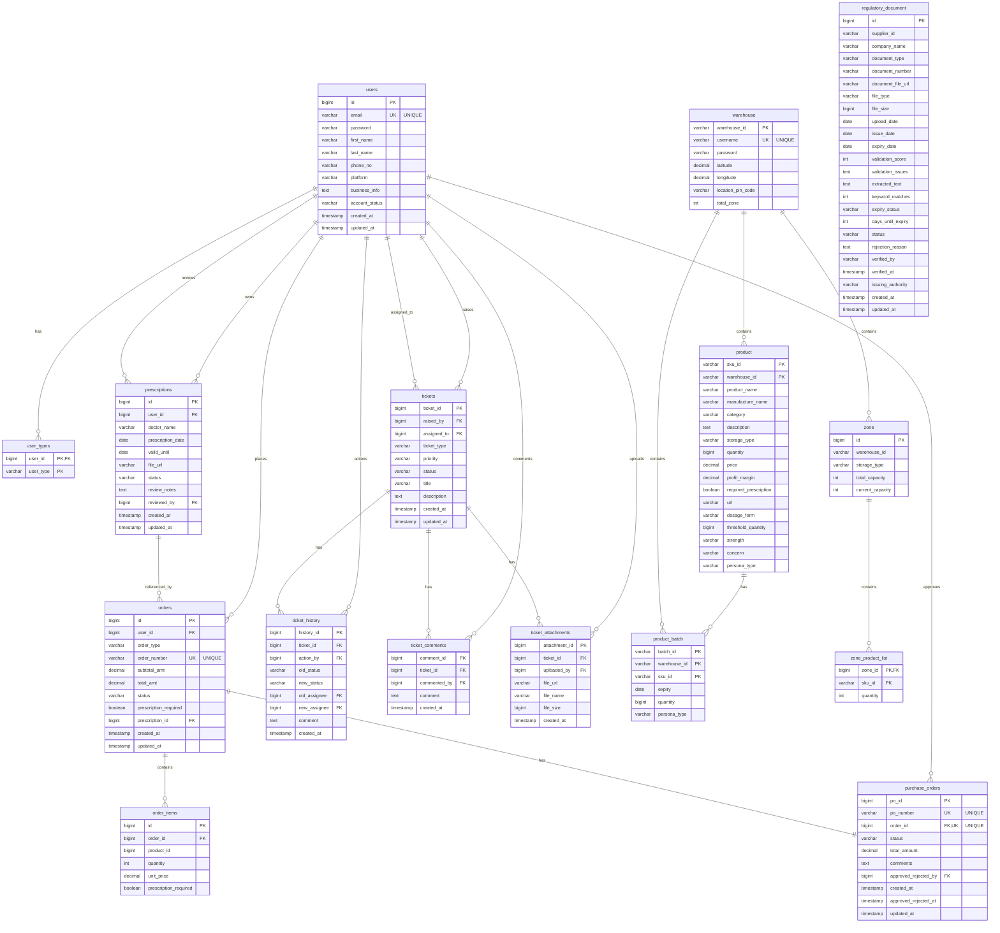

# Database Schema Documentation

## Database Overview

- **Database Name**: `adminauth`
- **Database Type**: MySQL 5.6.19
- **Engine**: InnoDB
- **Character Set**: utf8
- **Collation**: utf8_general_ci
- **Schema Management**: Flyway Migrations

## Entity Relationship Diagram (Mermaid)

## Database Tables

### 1. Users & Authentication

#### `users`
Stores user account information and authentication data.

| Column | Type | Constraints | Description |
|--------|------|-------------|-------------|
| `id` | BIGINT | PRIMARY KEY, AUTO_INCREMENT | Unique user identifier |
| `email` | VARCHAR(255) | NOT NULL, UNIQUE | User email address |
| `password` | VARCHAR(255) | NOT NULL | Hashed password (BCrypt) |
| `first_name` | VARCHAR(255) | NULL | User's first name |
| `last_name` | VARCHAR(255) | NULL | User's last name |
| `phone_no` | VARCHAR(20) | NULL | User's phone number |
| `platform` | VARCHAR(100) | NULL | Platform identifier |
| `business_info` | TEXT | NULL | Business information |
| `account_status` | VARCHAR(50) | NOT NULL | Account status (PENDING_APPROVAL, ACTIVE, REJECTED, SUSPENDED) |
| `created_at` | TIMESTAMP | NOT NULL, DEFAULT CURRENT_TIMESTAMP | Record creation timestamp |
| `updated_at` | TIMESTAMP | DEFAULT CURRENT_TIMESTAMP ON UPDATE | Record update timestamp |

**Indexes:**
- `idx_email` on `email`
- `idx_account_status` on `account_status`
- `idx_phone_no` on `phone_no`
- `idx_platform` on `platform`

#### `user_types`
Join table for user roles (many-to-many relationship).

| Column | Type | Constraints | Description |
|--------|------|-------------|-------------|
| `user_id` | BIGINT | PRIMARY KEY, FOREIGN KEY → users(id) | User identifier |
| `user_type` | VARCHAR(50) | PRIMARY KEY | User type (ADMIN, B2B, B2C, EXECUTIVE, WAREHOUSE) |

**Indexes:**
- `idx_user_type` on `user_type`

---

### 2. Support Tickets

#### `tickets`
Main table for support tickets.

| Column | Type | Constraints | Description |
|--------|------|-------------|-------------|
| `ticket_id` | BIGINT | PRIMARY KEY, AUTO_INCREMENT | Unique ticket identifier |
| `raised_by` | BIGINT | NOT NULL, FOREIGN KEY → users(id) | User who created the ticket |
| `assigned_to` | BIGINT | NULL, FOREIGN KEY → users(id) | User assigned to handle the ticket |
| `ticket_type` | VARCHAR(50) | NOT NULL | Ticket type (B2B, B2C, WAREHOUSE) |
| `priority` | VARCHAR(50) | NOT NULL | Priority level (CRITICAL, HIGH, MEDIUM, LOW) |
| `status` | VARCHAR(50) | NOT NULL | Ticket status (OPEN, IN_PROGRESS, RESOLVED, CLOSED) |
| `title` | VARCHAR(255) | NOT NULL | Ticket title |
| `description` | TEXT | NULL | Ticket description |
| `created_at` | TIMESTAMP | NOT NULL, DEFAULT CURRENT_TIMESTAMP | Ticket creation timestamp |
| `updated_at` | TIMESTAMP | DEFAULT CURRENT_TIMESTAMP ON UPDATE | Ticket update timestamp |

**Indexes:**
- `idx_raised_by` on `raised_by`
- `idx_assigned_to` on `assigned_to`
- `idx_status` on `status`
- `idx_priority` on `priority`
- `idx_ticket_type` on `ticket_type`

#### `ticket_history`
Tracks all status and assignee changes for tickets.

| Column | Type | Constraints | Description |
|--------|------|-------------|-------------|
| `history_id` | BIGINT | PRIMARY KEY, AUTO_INCREMENT | Unique history record identifier |
| `ticket_id` | BIGINT | NOT NULL, FOREIGN KEY → tickets(ticket_id) | Ticket identifier |
| `action_by` | BIGINT | NOT NULL, FOREIGN KEY → users(id) | User who performed the action |
| `old_status` | VARCHAR(50) | NULL | Previous ticket status |
| `new_status` | VARCHAR(50) | NULL | New ticket status |
| `old_assignee` | BIGINT | NULL, FOREIGN KEY → users(id) | Previous assignee |
| `new_assignee` | BIGINT | NULL, FOREIGN KEY → users(id) | New assignee |
| `comment` | TEXT | NULL | Action comment |
| `created_at` | TIMESTAMP | NOT NULL, DEFAULT CURRENT_TIMESTAMP | History record creation timestamp |

**Indexes:**
- `idx_ticket_id` on `ticket_id`
- `idx_action_by` on `action_by`
- `idx_created_at` on `created_at`

#### `ticket_comments`
User comments on tickets.

| Column | Type | Constraints | Description |
|--------|------|-------------|-------------|
| `comment_id` | BIGINT | PRIMARY KEY, AUTO_INCREMENT | Unique comment identifier |
| `ticket_id` | BIGINT | NOT NULL, FOREIGN KEY → tickets(ticket_id) | Ticket identifier |
| `commented_by` | BIGINT | NOT NULL, FOREIGN KEY → users(id) | User who created the comment |
| `comment` | TEXT | NOT NULL | Comment text |
| `created_at` | TIMESTAMP | NOT NULL, DEFAULT CURRENT_TIMESTAMP | Comment creation timestamp |

**Indexes:**
- `idx_ticket_id` on `ticket_id`
- `idx_commented_by` on `commented_by`
- `idx_created_at` on `created_at`

#### `ticket_attachments`
File attachments for tickets.

| Column | Type | Constraints | Description |
|--------|------|-------------|-------------|
| `attachment_id` | BIGINT | PRIMARY KEY, AUTO_INCREMENT | Unique attachment identifier |
| `ticket_id` | BIGINT | NOT NULL, FOREIGN KEY → tickets(ticket_id) | Ticket identifier |
| `uploaded_by` | BIGINT | NOT NULL, FOREIGN KEY → users(id) | User who uploaded the file |
| `file_url` | VARCHAR(500) | NOT NULL | File storage URL |
| `file_name` | VARCHAR(255) | NULL | Original file name |
| `file_size` | BIGINT | NULL | File size in bytes |
| `created_at` | TIMESTAMP | NOT NULL, DEFAULT CURRENT_TIMESTAMP | Attachment creation timestamp |

**Indexes:**
- `idx_ticket_id` on `ticket_id`
- `idx_uploaded_by` on `uploaded_by`
- `idx_created_at` on `created_at`

---

### 3. Orders & Prescriptions

#### `prescriptions`
Prescription uploads and validation data.

| Column | Type | Constraints | Description |
|--------|------|-------------|-------------|
| `id` | BIGINT | PRIMARY KEY, AUTO_INCREMENT | Unique prescription identifier |
| `user_id` | BIGINT | NOT NULL, FOREIGN KEY → users(id) | User who uploaded the prescription |
| `doctor_name` | VARCHAR(255) | NULL | Prescribing doctor's name |
| `prescription_date` | DATE | NOT NULL | Date of prescription |
| `valid_until` | DATE | NOT NULL | Prescription validity expiry date |
| `file_url` | VARCHAR(500) | NOT NULL | Prescription file storage URL |
| `status` | VARCHAR(50) | NOT NULL | Prescription status (UPLOADED, APPROVED, REJECTED) |
| `review_notes` | TEXT | NULL | Review notes from validator |
| `reviewed_by` | BIGINT | NULL, FOREIGN KEY → users(id) | User who reviewed the prescription |
| `created_at` | TIMESTAMP | NOT NULL, DEFAULT CURRENT_TIMESTAMP | Prescription creation timestamp |
| `updated_at` | TIMESTAMP | DEFAULT CURRENT_TIMESTAMP ON UPDATE | Prescription update timestamp |

**Indexes:**
- `idx_user_id` on `user_id`
- `idx_status` on `status`
- `idx_reviewed_by` on `reviewed_by`

#### `orders`
Customer orders.

| Column | Type | Constraints | Description |
|--------|------|-------------|-------------|
| `id` | BIGINT | PRIMARY KEY, AUTO_INCREMENT | Unique order identifier |
| `user_id` | BIGINT | NOT NULL, FOREIGN KEY → users(id) | Customer who placed the order |
| `order_type` | VARCHAR(50) | NOT NULL | Order type (B2B, B2C) |
| `order_number` | VARCHAR(255) | NOT NULL, UNIQUE | Unique order number |
| `subtotal_amt` | DECIMAL(19,2) | NOT NULL | Order subtotal amount |
| `total_amt` | DECIMAL(19,2) | NOT NULL | Order total amount |
| `status` | VARCHAR(100) | NOT NULL | Order status (PROCESSING, CONFIRMED, SHIPPED, DELIVERED, CANCELLED) |
| `prescription_required` | BOOLEAN | NOT NULL | Whether prescription is required |
| `prescription_id` | BIGINT | NULL, FOREIGN KEY → prescriptions(id) | Associated prescription |
| `created_at` | TIMESTAMP | NOT NULL, DEFAULT CURRENT_TIMESTAMP | Order creation timestamp |
| `updated_at` | TIMESTAMP | DEFAULT CURRENT_TIMESTAMP ON UPDATE | Order update timestamp |

**Indexes:**
- `idx_user_id` on `user_id`
- `idx_order_type` on `order_type`
- `idx_status` on `status`
- `idx_order_number` on `order_number`
- `idx_prescription_id` on `prescription_id`

#### `order_items`
Line items for orders.

| Column | Type | Constraints | Description |
|--------|------|-------------|-------------|
| `id` | BIGINT | PRIMARY KEY, AUTO_INCREMENT | Unique order item identifier |
| `order_id` | BIGINT | NOT NULL, FOREIGN KEY → orders(id) | Order identifier |
| `product_id` | BIGINT | NOT NULL | Product identifier (references product.sku_id) |
| `quantity` | INT | NOT NULL | Item quantity |
| `unit_price` | DECIMAL(19,2) | NOT NULL | Unit price at time of order |
| `prescription_required` | BOOLEAN | NOT NULL | Whether prescription is required for this item |

**Indexes:**
- `idx_order_id` on `order_id`
- `idx_product_id` on `product_id`

#### `purchase_orders`
Purchase orders for order fulfillment.

| Column | Type | Constraints | Description |
|--------|------|-------------|-------------|
| `po_id` | BIGINT | PRIMARY KEY, AUTO_INCREMENT | Unique purchase order identifier |
| `po_number` | VARCHAR(255) | NOT NULL, UNIQUE | Unique purchase order number |
| `order_id` | BIGINT | NOT NULL, UNIQUE, FOREIGN KEY → orders(id) | Associated order (one-to-one) |
| `status` | VARCHAR(50) | NOT NULL | PO status (PENDING, APPROVED, REJECTED) |
| `total_amount` | DECIMAL(19,2) | NOT NULL | Purchase order total amount |
| `comments` | TEXT | NULL | Approval/rejection comments |
| `approved_rejected_by` | BIGINT | NULL, FOREIGN KEY → users(id) | User who approved/rejected |
| `created_at` | TIMESTAMP | NOT NULL, DEFAULT CURRENT_TIMESTAMP | PO creation timestamp |
| `approved_rejected_at` | TIMESTAMP | NULL | Approval/rejection timestamp |
| `updated_at` | TIMESTAMP | DEFAULT CURRENT_TIMESTAMP ON UPDATE | PO update timestamp |

**Indexes:**
- `idx_order_id` on `order_id`
- `idx_po_number` on `po_number`
- `idx_status` on `status`
- `idx_approved_rejected_by` on `approved_rejected_by`

---

### 4. Inventory Management

#### `warehouse`
Warehouse locations and information.

| Column | Type | Constraints | Description |
|--------|------|-------------|-------------|
| `warehouse_id` | VARCHAR(10) | PRIMARY KEY | Unique warehouse identifier |
| `username` | VARCHAR(50) | NOT NULL, UNIQUE | Warehouse username |
| `password` | VARCHAR(255) | NOT NULL | Warehouse password |
| `latitude` | DECIMAL(10,8) | NOT NULL | Warehouse latitude |
| `longitude` | DECIMAL(11,8) | NOT NULL | Warehouse longitude |
| `location_pin_code` | VARCHAR(10) | NOT NULL | Location PIN code |
| `total_zone` | INT | NOT NULL | Total number of zones |

#### `product`
Product catalog information.

| Column | Type | Constraints | Description |
|--------|------|-------------|-------------|
| `sku_id` | VARCHAR(50) | PRIMARY KEY | Stock Keeping Unit identifier |
| `warehouse_id` | VARCHAR(10) | PRIMARY KEY | Warehouse identifier (composite key) |
| `product_name` | VARCHAR(255) | NOT NULL | Product name |
| `manufacture_name` | VARCHAR(100) | NOT NULL | Manufacturer name |
| `category` | VARCHAR(50) | NOT NULL | Product category |
| `description` | TEXT | NULL | Product description |
| `storage_type` | VARCHAR(20) | NOT NULL | Storage type (NORMAL, COLD, FROZEN) |
| `quantity` | BIGINT | NOT NULL | Available quantity |
| `price` | DECIMAL(10,2) | NOT NULL | Product price |
| `profit_margin` | DECIMAL(5,2) | NULL | Profit margin percentage |
| `required_prescription` | BOOLEAN | NOT NULL | Whether prescription is required |
| `url` | VARCHAR(500) | NULL | Product URL |
| `dosage_form` | VARCHAR(20) | NOT NULL | Dosage form |
| `threshold_quantity` | BIGINT | NOT NULL | Low stock threshold |
| `strength` | VARCHAR(50) | NULL | Product strength |
| `concern` | VARCHAR(20) | NULL | Concern type |
| `persona_type` | VARCHAR(10) | NOT NULL | Persona type (B2B, B2C, BOTH) |

**Unique Constraints:**
- Composite unique key on (`sku_id`, `warehouse_id`)

#### `product_batch`
Product batch information with expiry tracking.

| Column | Type | Constraints | Description |
|--------|------|-------------|-------------|
| `batch_id` | VARCHAR(50) | PRIMARY KEY | Batch identifier |
| `warehouse_id` | VARCHAR(10) | PRIMARY KEY | Warehouse identifier (composite key) |
| `sku_id` | VARCHAR(50) | PRIMARY KEY | Product SKU (composite key) |
| `expiry` | DATE | NOT NULL | Batch expiry date |
| `quantity` | BIGINT | NOT NULL | Batch quantity |
| `persona_type` | VARCHAR(10) | NOT NULL | Persona type (B2B, B2C, BOTH) |

**Unique Constraints:**
- Composite unique key on (`batch_id`, `warehouse_id`, `sku_id`)

#### `zone`
Storage zones within warehouses.

| Column | Type | Constraints | Description |
|--------|------|-------------|-------------|
| `id` | BIGINT | PRIMARY KEY, AUTO_INCREMENT | Unique zone identifier |
| `warehouse_id` | VARCHAR(10) | NOT NULL | Warehouse identifier |
| `storage_type` | VARCHAR(20) | NOT NULL | Storage type (NORMAL, COLD, FROZEN) |
| `total_capacity` | INT | NOT NULL | Total zone capacity |
| `current_capacity` | INT | NOT NULL | Current capacity used |

#### `zone_product_list`
Collection table for products in zones (ElementCollection mapping).

| Column | Type | Constraints | Description |
|--------|------|-------------|-------------|
| `zone_id` | BIGINT | PRIMARY KEY, FOREIGN KEY → zone(id) | Zone identifier |
| `sku_id` | VARCHAR(50) | PRIMARY KEY | Product SKU (Map key) |
| `quantity` | INT | NULL | Product quantity in zone (Map value) |

#### `regulatory_document`
Regulatory and compliance documents.

| Column | Type | Constraints | Description |
|--------|------|-------------|-------------|
| `id` | BIGINT | PRIMARY KEY, AUTO_INCREMENT | Unique document identifier |
| `supplier_id` | VARCHAR(50) | NULL | Supplier identifier |
| `company_name` | VARCHAR(255) | NOT NULL | Company name |
| `document_type` | VARCHAR(50) | NOT NULL | Document type |
| `document_number` | VARCHAR(100) | NULL | Document number |
| `document_file_url` | VARCHAR(500) | NULL | Document file URL |
| `file_type` | VARCHAR(10) | NULL | File type (PDF, etc.) |
| `file_size` | BIGINT | NULL | File size in bytes |
| `upload_date` | DATE | NOT NULL | Upload date |
| `issue_date` | DATE | NULL | Document issue date |
| `expiry_date` | DATE | NULL | Document expiry date |
| `validation_score` | INT | NULL | AI validation score |
| `validation_issues` | TEXT | NULL | Validation issues (JSON) |
| `extracted_text` | TEXT | NULL | Extracted text from document |
| `keyword_matches` | INT | NULL | Keyword match count |
| `expiry_status` | VARCHAR(20) | NULL | Expiry status |
| `days_until_expiry` | INT | NULL | Days until expiry |
| `status` | VARCHAR(20) | NOT NULL | Document status (PENDING_REVIEW, VERIFIED, REJECTED) |
| `rejection_reason` | TEXT | NULL | Rejection reason |
| `verified_by` | VARCHAR(100) | NULL | User who verified |
| `verified_at` | TIMESTAMP | NULL | Verification timestamp |
| `issuing_authority` | VARCHAR(255) | NULL | Issuing authority |
| `created_at` | TIMESTAMP | NULL | Record creation timestamp |
| `updated_at` | TIMESTAMP | NULL | Record update timestamp |

---

## Relationships

### Foreign Key Relationships

1. **users** ← `user_types.user_id`
2. **users** ← `tickets.raised_by`, `tickets.assigned_to`
3. **users** ← `prescriptions.user_id`, `prescriptions.reviewed_by`
4. **users** ← `orders.user_id`
5. **users** ← `purchase_orders.approved_rejected_by`
6. **users** ← `ticket_history.action_by`, `ticket_history.old_assignee`, `ticket_history.new_assignee`
7. **users** ← `ticket_comments.commented_by`
8. **users** ← `ticket_attachments.uploaded_by`
9. **tickets** ← `ticket_history.ticket_id`
10. **tickets** ← `ticket_comments.ticket_id`
11. **tickets** ← `ticket_attachments.ticket_id`
12. **prescriptions** ← `orders.prescription_id`
13. **orders** ← `order_items.order_id`
14. **orders** ← `purchase_orders.order_id` (ONE-TO-ONE)
15. **zone** ← `zone_product_list.zone_id`

### Cascade Behaviors

- `ON DELETE CASCADE`: When a parent record is deleted, all related child records are automatically deleted.
  - Applied to: `user_types`, `tickets`, `prescriptions`, `orders`, `order_items`, `purchase_orders`, `ticket_history`, `ticket_comments`, `ticket_attachments`

- `ON DELETE SET NULL`: When a parent record is deleted, foreign key values in child records are set to NULL.
  - Applied to: `tickets.assigned_to`, `prescriptions.reviewed_by`, `purchase_orders.approved_rejected_by`, `ticket_history.old_assignee`, `ticket_history.new_assignee`

---

## Enumerated Values

### Account Status (users.account_status)
- `PENDING_APPROVAL`
- `ACTIVE`
- `REJECTED`
- `SUSPENDED`

### User Types (user_types.user_type)
- `ADMIN`
- `B2B`
- `B2C`
- `EXECUTIVE`
- `WAREHOUSE`

### Ticket Status (tickets.status)
- `OPEN`
- `IN_PROGRESS`
- `RESOLVED`
- `CLOSED`

### Ticket Priority (tickets.priority)
- `CRITICAL`
- `HIGH`
- `MEDIUM`
- `LOW`

### Ticket Type (tickets.ticket_type)
- `B2B`
- `B2C`
- `WAREHOUSE`

### Prescription Status (prescriptions.status)
- `UPLOADED`
- `APPROVED`
- `REJECTED`

### Order Status (orders.status)
- `PROCESSING`
- `CONFIRMED`
- `SHIPPED`
- `DELIVERED`
- `CANCELLED`

### Purchase Order Status (purchase_orders.status)
- `PENDING`
- `APPROVED`
- `REJECTED`

### Storage Type (product.storage_type, zone.storage_type)
- `NORMAL`
- `COLD`
- `FROZEN`

### Persona Type (product.persona_type, product_batch.persona_type)
- `B2B`
- `B2C`
- `BOTH`

---

## Indexes Summary

All tables have appropriate indexes on:
- Primary keys (automatic)
- Foreign keys (for join performance)
- Frequently queried columns (status, type, priority, etc.)
- Unique constraints (email, order_number, po_number, etc.)

---

## Migration Files

The database schema is managed through Flyway migrations located in:
`backend/adminauth/src/main/resources/db/migration/`

1. `V1__create_users_table.sql` - Users and user types
2. `V2__create_ticket_tables.sql` - Ticket management tables
3. `V3__create_order_management_tables.sql` - Orders, prescriptions, order items
4. `V4__add_user_phone_platform_business_info.sql` - User additional fields
5. `V5__add_purchase_orders_and_order_status.sql` - Purchase orders

Note: Inventory tables (product, warehouse, zone, product_batch, regulatory_document) are managed by Hibernate ORM auto-creation or manual setup.

---

## Data Integrity

- All foreign keys are properly defined with appropriate cascade behaviors
- Unique constraints ensure data uniqueness where required
- NOT NULL constraints enforce data completeness
- Timestamps automatically track record creation and updates
- Composite keys used for multi-column uniqueness (product, product_batch, user_types)
